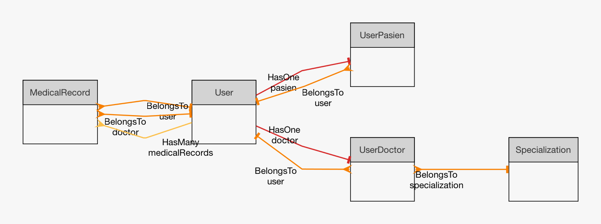

<p align="center">
  <a href="https://laravel.com" target="_blank">
    
  </a>
</p>

<h1 align="center">WASIK - Sistem Informasi Klinik</h1>
<p align="center">
  <b>WASIK</b> adalah aplikasi manajemen klinik berbasis web yang dibangun menggunakan Laravel, Bootstrap 5, dan template <a href="https://prium.github.io/phoenix/v1.22.0/showcase.html">Phoenix</a>. Mendukung pengelolaan pasien, dokter, admin, serta fitur modern lainnya.
</p>

---

## 🚀 Langkah Instalasi

1. **Clone repository**
   ```bash
   git clone <repository-url>
   cd wasik
   ```

2. **Install dependency backend**
   ```bash
   composer install
   ```

3. **Copy file environment**
   ```bash
   cp .env.example .env
   ```

4. **Generate application key**
   ```bash
   php artisan key:generate
   ```

5. **Konfigurasi database**
   - Edit file `.env` dan sesuaikan konfigurasi database sesuai kebutuhan.

6. **Install dependency frontend**
   ```bash
   npm install
   ```

7. **Build asset frontend**
   ```bash
   npm run dev
   ```

8. **Jalankan migrasi & seeder**
   ```bash
   php artisan migrate --seed
   ```

9. **Jalankan aplikasi**
   ```bash
   php artisan serve
   ```
   Akses aplikasi di [http://localhost:8000](http://localhost:8000)

---

## 👤 Daftar User Login (Default)

| Role   | Email               | Password  |
|--------|---------------------|-----------|
| Pasien | pasien@example.com  | password  |
| Dokter | dokter@example.com  | password  |
| Admin  | admin@example.com   | password  |

---

## 🗂️ ERD / Skema Database

Berikut adalah gambaran skema database utama berdasarkan migration:



> File ERD dapat ditemukan di `erd-wasic.png`.
---

## 🛠️ Source & Teknologi

- **Template**: [Phoenix v1.22.0](https://prium.github.io/phoenix/v1.22.0/showcase.html)
- **Framework**: Laravel 10.x
- **CSS Framework**: Bootstrap 5
- **Javascript**: ES6, Vite
- **Database**: MySQL/MariaDB
- **Autentikasi**: Laravel Breeze
- **Role & Permission**: Spatie Laravel Permission
- **Fitur Lain**: Modular, RESTful, Responsive Design

---

## ℹ️ Tentang Aplikasi

Aplikasi ini dibuat sebagai bagian dari **technical test**.
Silakan gunakan untuk keperluan evaluasi, pengujian, atau pengembangan lebih lanjut.

---

<p align="center">
  <i>Developed with ❤️ using Laravel & Phoenix Template</i>
</p>
